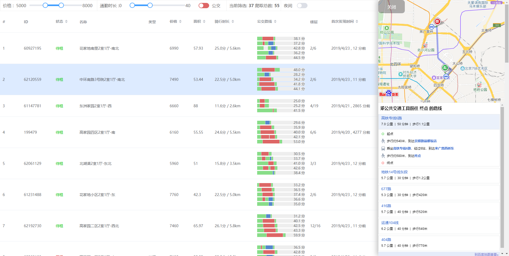

# 自如租房助手

## 功能
- 不断循环爬取多个关键词的房源信息
- 随机间隔(可配置间隔平均数)
- OCR 识别房源价格 (`tesseract.js`实现)
- 根据配置的工作地点(经纬度坐标)计算通勤时长
- 列表展示, 支持排序和筛选, 自动刷新

## 使用
- 申请 [百度地图 API AK](http://lbsyun.baidu.com/index.php) 并配置到 config 中 (可选, 如果不申请就不会计算通勤距离)
- `npm i`
- 下载 [eng.traineddata.gz](https://github.com/naptha/tessdata/blob/gh-pages/3.02/eng.traineddata.gz) 中的源文件并解压到根目录的`eng.traineddata`
- `node app.js` 启动, 将自动打开 `localhost:8000` 网页服务

## 未来的功能
- 房源变动提醒 (使用 `notification`)

## 更新日志

### 2018-09-02
- 增加 OCR 识别价格
- 优化控制台日志
- 自动打开网页